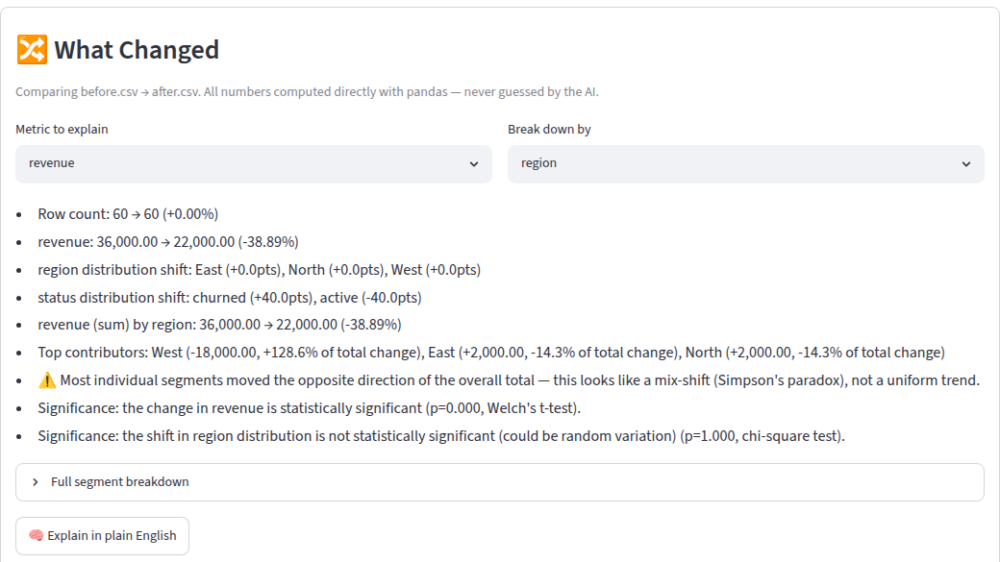
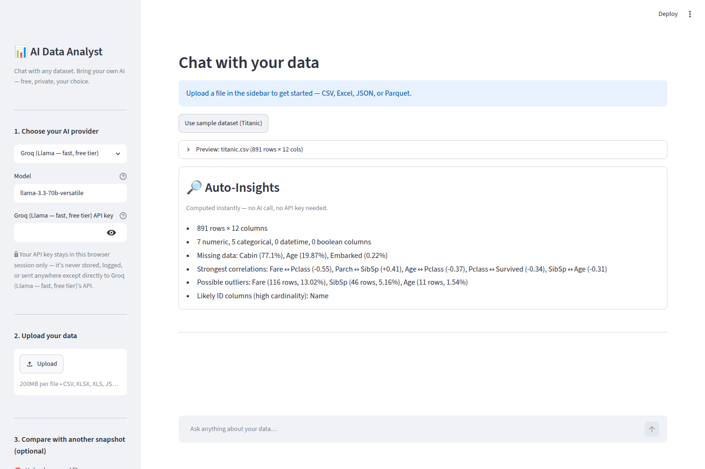
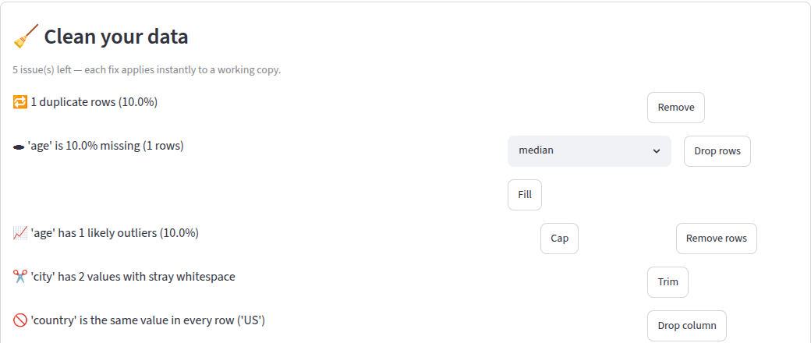

# 📊 AI Data Analyst

[](LICENSE)
[](https://github.com/NaiaLorente/data-analyst/actions/workflows/ci.yml)
[](https://github.com/NaiaLorente/data-analyst/actions/workflows/docker.yml)
[](requirements.txt)
[](https://streamlit.io)
[](CONTRIBUTING.md)
[](https://data-analyst-eezp6m5c9qcyuqcwxcklh7.streamlit.app/)

**Did your numbers change? Find out why — and whether it's real — in one upload.**

👉 **[Try the live demo](https://data-analyst-eezp6m5c9qcyuqcwxcklh7.streamlit.app/)** — no install, no signup, opens straight to a real dataset with real results.

Upload two snapshots of similar data (this week vs. last week, this month vs. last) and get an instant, plain-English root-cause breakdown: not just "revenue dropped 12%," but *"revenue dropped 12%, driven almost entirely by a 40% collapse in the West region — and that drop is statistically significant, not noise."* Root-cause and drift-detection tools that do this (Monte Carlo, Anomalo, ThoughtSpot) are normally expensive enterprise SaaS with a data team behind them. This is the free, zero-setup version — pandas and scipy compute every number, an LLM only ever narrates them.

It's also **bring-your-own-key by design**: no API key ships with this project and nothing is proxied through a third-party server. Pick a provider you already pay for, or a fully local model via Ollama that costs nothing at all — it talks directly to that provider from your own machine or browser session. Then keep going: ask follow-up questions, clean up the data, export a shareable report.

<p align="center">
  
  <br><br>
  
  <br><br>
  
</p>

---

## Why this exists

Explaining a metric move is one of the most common, most time-consuming tasks in any data-adjacent job, and there was no free, zero-setup way to do it well. This project closes that specific gap:

- **Root-cause analysis, not just a chatbot.** [What Changed](#what-changed) decomposes a metric's change by segment, flags mix-shifts (Simpson's paradox), and runs a significance test so you know whether a move is real signal or just noise — a real recurring analyst task, solved in one upload.
- **Cleaning, not just analysis.** [Clean your data](#clean-your-data) turns the duplicates/missing-values/outliers/wrong-dtypes Auto-Insights already found into one-click fixes, so you leave with a usable file, not just a diagnosis.
- **Numbers are never invented.** Every statistic — in chat, in Auto-Insights, in What Changed — comes from an actual pandas/scipy computation. The AI is only ever allowed to narrate pre-verified numbers, never to state its own — and every chat answer shows the pandas code behind it, so you can verify and reuse it yourself.
- **Your data never leaves your machine.** There's no backend server storing anything — the app talks directly from your session to the AI provider you chose.
- **Your AI, your choice.** Anthropic, OpenAI, Google Gemini, Groq, xAI, or a fully local model via Ollama — pick per session, switch anytime, no code changes.
- **Genuinely free is an option.** Run it with Ollama and there is no API key, no bill, and no internet round-trip for your data at all.
- **Useful before you've configured anything.** The moment you upload a file, [Auto-Insights](#auto-insights) computes real findings — missing data, outliers, correlations — with zero AI calls and zero setup.
- **Nothing is lost when you close the tab.** [Save / load your session](#save--load-your-session) writes the dataset, chat, and cleaning progress to one local file — the no-backend alternative to an account, at zero hosting cost.

---

## Features

- **What Changed — root-cause drift analysis** — compare two files, or split one file by a column, and get an automatic breakdown of what moved, which segment drove it, whether it's a broad trend or a mix-shift, and whether the change is statistically significant, all computed with pandas/scipy (zero AI cost), with an optional one-click AI narrative on top
- **Statistical significance testing** — a Welch's t-test on numeric metric changes and a chi-square test on categorical distribution shifts, so "revenue dropped 12%" comes with an answer to "...or is that just noise?"
- **PII detection** — before any data reaches the AI provider you chose, the app scans for columns that look like emails, phone numbers, SSNs, credit card numbers, or IP addresses, and lets you exclude them from chat and narration with one click — the rest of the app (Auto-Insights, cleaning, charts) still works on the full data
- **"What predicts this?" — feature importance** — pick a target column and train a quick baseline Random Forest (classifier or regressor, auto-detected) on the rest of the data to see which columns actually drive it, not just correlate with it — download the trained model as a `.pkl` when you're done
- **Segments** — KMeans clustering on standardized numeric columns finds natural groups in your data (customer segments, usage tiers) with no target column needed, profiled by which columns actually define each group and visualized as a 2D PCA scatter
- **Trend & forecast** — linear trend + weekly-seasonality decomposition and a short forecast (with a confidence band) for any date column + metric
- **Cohort & retention** — group users by the period of their first activity and track what fraction stick around in each period after, the classic retention-triangle heatmap used constantly in growth/product analytics
- **Join files** — combine your working dataset with a second file on a shared key (orders + customers, events + users), with suggested join keys and a match-rate check before you commit to the result
- **A/B test calculator** — a two-proportion z-test with a confidence interval on the difference, for conversion-rate/click-through-rate comparisons — paste in counts from any A/B testing tool, no dataset required
- **Regression fit lines** — ask the chat agent to plot two variables with a trend line and it adds R²/slope/p-value, not just a scatter to eyeball
- **Explore a column** — pick any column for full descriptive stats (mean/median/std/quartiles for numbers, top values for categories, min/max for dates) and a distribution chart, computed instantly
- **Clean your data** — one-click fixes (remove duplicates, fill or drop missing values, cap or remove outliers, trim stray whitespace, convert wrongly-typed numbers/dates, drop constant or empty columns) for the same issues Auto-Insights already flagged, then download the cleaned CSV
- **Export as notebook** — download a self-contained Jupyter notebook (data embedded inline) that reproduces the analyses you ran — pure pandas/scikit-learn code, no dependency on this app, so the work continues in your own environment
- **Save / load your session** — one file with your dataset, chat history, and cleaning progress, so nothing is lost when you close the tab — no account, no server, no cost, pick up exactly where you left off later or on another machine
- **Natural language queries** — ask questions, get answers, no SQL or code
- **View the code** — every chat answer includes the exact pandas snippet that produced it, so you can verify it and reuse it in your own notebook
- **Auto-Insights on upload** — instant, LLM-free summary of nulls, outliers, correlations, likely ID columns, and duplicate rows the moment a file loads
- **Multi-turn conversation** — follow-up questions retain context
- **Multi-format uploads** — CSV, Excel (`.xlsx`/`.xls`), JSON, and Parquet
- **9 built-in analysis tools** the agent can call:
  - `get_summary` — dtypes, nulls, descriptive statistics
  - `get_value_counts` — most frequent categories
  - `get_correlation_matrix` — Pearson correlations
  - `filter_rows` — `eq / gt / lt / gte / lte / contains` operators
  - `compare_groups` — root-cause "why did X change" analysis, callable straight from chat
  - `plot_histogram` — numeric distributions
  - `plot_bar` — categorical frequency charts
  - `plot_scatter` — two-variable scatter with optional colour grouping or a regression fit line
  - `plot_heatmap` — correlation heatmap
- **Shareable reports** — export the full conversation, Auto-Insights, and What Changed (with charts) as a self-contained HTML file or Markdown, for sharing or archiving
- **CLI / scheduled checks** — run What Changed from cron or CI (`python -m agent.cli check before.csv after.csv --fail-on-significant`), no browser or AI key needed; also usable as a drop-in GitHub Action (`uses: NaiaLorente/data-analyst@v1.0.0`), published on the GitHub Marketplace
- **Streamlit UI** — clean, shareable web interface
- **Fully local** — no backend, no telemetry; your file and your key stay in your own session

---

## Bring your own AI

Pick a provider from the sidebar dropdown. Every option is "bring your own key" — this project never provides or pays for API access.

| Provider | Cost | Notes |
|---|---|---|
| **Anthropic (Claude)** | Pay-as-you-go | [console.anthropic.com](https://console.anthropic.com/) |
| **OpenAI (GPT)** | Pay-as-you-go | [platform.openai.com](https://platform.openai.com/api-keys) |
| **Google (Gemini)** | Free tier available | [aistudio.google.com](https://aistudio.google.com/apikey) |
| **Groq (Llama)** | Generous free tier, very fast | [console.groq.com](https://console.groq.com/keys) |
| **xAI (Grok)** | Pay-as-you-go | [console.x.ai](https://console.x.ai/) |
| **Ollama (local models)** | **100% free, no key, fully offline** | [ollama.com](https://ollama.com/download) |

Model names are editable in the UI, so you're not locked to the defaults — point it at any tool-calling-capable model your provider supports.

> **Groq ≠ xAI/Grok.** These are unrelated companies with near-identical names — a very common mix-up. Groq (console.groq.com) is a fast-inference hosting company; keys start with `gsk_`. xAI (console.x.ai) makes the Grok model; keys start with `xai-`. Pick the matching provider in the sidebar for the key you have, or you'll get a 401 error.

### Zero-cost setup with Ollama

```bash
# Install Ollama, then pull a tool-calling-capable model
ollama pull llama3.1

# Point the app at it — no API key needed
streamlit run app.py
# In the sidebar: Provider = Ollama
```

Your dataset and questions never touch the internet in this mode.

---

## What Changed

Two ways to compare, both in the sidebar under "Compare with another snapshot":

- **Upload a second file** — compare against a separately exported snapshot (last week's export vs. this week's).
- **Split this file by a column** — no second file needed. Pick a column (month, quarter, cohort, `Survived`, anything) and two values, and the app splits your single upload into two groups and compares them. This is the fastest path for the common case: one file that already contains multiple periods or categories.

Either way, a dedicated drift engine runs against the two groups — no AI call required for the numbers themselves:

- **Schema diff** — added/removed columns, dtype changes, row count change
- **Metric diff** — every shared numeric column's sum/mean before vs. after, ranked by size of change
- **Category shift** — distribution changes, new values, dropped values for shared categorical columns
- **Driver / root-cause breakdown** — pick a metric and a segment column, and it decomposes the total change per segment, so you can see e.g. that one region caused 80% of an overall decline
- **Mix-shift detection** — flags when the total moves one way while most individual segments move the other way (a classic Simpson's paradox trap)
- **Significance testing** — a Welch's t-test on the metric and a chi-square test on the segment's distribution shift, so you know whether a move is a real signal or could plausibly be random variation

Column and value defaults are picked with a simple heuristic that skips obvious ID columns (like a row index or primary key), so the first thing you see is usually a meaningful comparison, not a degenerate one.

Click **"Explain in plain English"** to have your chosen AI provider narrate these pre-computed numbers as a short paragraph — the model is explicitly instructed to only explain the given figures, never to state its own.

You don't have to use the dedicated widget, either — the chat agent has the same capability as a tool (`compare_groups`), so you can just ask *"why did survival rate differ by class?"* in plain language and it'll run the same root-cause analysis on the fly.

---

## Auto-Insights

The instant you upload a file, the app runs a fast, pure-pandas pass over your data — no AI call, no API key required — and surfaces:

- Row/column counts and dtype breakdown
- Columns with missing data, ranked by severity
- The strongest correlations between numeric columns
- Columns with likely outliers (IQR method)
- Columns that look like ID fields (near-unique values)
- Duplicate row count

This means the app is useful — and demo-able — before you've entered any credentials at all.

---

## Explore a column

Auto-Insights summarizes the whole dataset; this is the zoomed-in version. Pick any column from the dropdown and get, instantly and with zero AI cost:

- **Numeric columns** — mean, median, standard deviation, min/max, and quartiles
- **Categorical columns** — unique value count and the top 10 most frequent values with counts
- **Datetime columns** — the earliest and latest dates
- **Boolean columns** — the True/False split

...plus a distribution chart (histogram for numbers, bar chart of top values for everything else) — a lightweight, on-demand alternative to running a full pandas-profiling report.

---

## Personal data detection (PII)

Before anything reaches a third-party AI provider, the app scans every column for formats that look like personal data — email addresses, phone numbers, US Social Security numbers, credit card numbers (validated with the Luhn checksum, not just a digit-count guess), and IP addresses. If it finds any, a warning box lists them with a multiselect (defaulting to "exclude everything found") that controls exactly which columns are stripped out before chat or AI narration ever sees the data.

This is deliberately conservative: it's format/regex-based, not a name-detection model, so it won't flag a free-text "Notes" column just because it mentions a customer's name — but it also won't miss an obvious email or SSN column. Everything else in the app (Auto-Insights, Explore a column, Clean your data, charts) keeps using the full dataset — only the path to the AI provider is filtered, since that's the only place data leaves your session.

---

## "What predicts this?"

Everything above is descriptive (Auto-Insights, Explore a column) or hypothesis-testing (What Changed's significance tests) — this is the first genuinely predictive capability. Pick a target column and hit **Run**: the app trains a baseline Random Forest (classifier or regressor, auto-detected from the target's dtype — a 0/1 or small-integer-coded column like `Survived` or `Churn` is correctly treated as classification, not regression) on the rest of the columns, evaluates it on a held-out test split, and shows which features actually drove the prediction, ranked.

This answers a different question than correlation does: correlation is pairwise and linear; this is multivariate and captures non-linear relationships and interactions a correlation matrix would miss entirely. Zero AI cost — scikit-learn only, gated behind a button so it only trains when you ask.

Once a model has been trained, **"⬇️ Download trained model (.pkl)"** gives you a pickled bundle (the fitted model, the feature-column order, and the label encoders used) so you can load it and make predictions outside the app with `pickle.load()`.

---

## Segments

The unsupervised complement to "What predicts this?" — no target column required. Pick which numeric columns to segment on (defaults to all of them) and how many groups to look for, and the app standardizes those columns and runs KMeans. Each cluster is profiled by which columns deviate most from the overall average in standard-deviation units — so you get "Cluster 2 is notably higher income, lower spending" instead of just raw cluster means — plus a 2D PCA scatter so you can see the separation between groups visually.

---

## Trend & forecast

Auto-Insights and What Changed both describe a snapshot or a two-point comparison; this looks at what's happening *continuously*. Pick a date column and a numeric metric, and it fits a linear trend, detects weekly seasonality (e.g. "revenue dips 18% on weekends"), and forecasts a couple of weeks ahead with an 80% confidence band — all from a simple, fast, dependency-light decomposition (no ARIMA/Prophet), pure pandas/numpy, zero AI cost.

---

## Cohort & retention

Needs an event log — one row per user per activity (a transactions, logins, or events table), not an aggregated snapshot. Pick a user/ID column, an event-date column, and a period (daily/weekly/monthly), and the app groups users into cohorts by the period of their *first* activity, then tracks what fraction of each cohort is still active in every period after — the "retention triangle" heatmap that's a staple of growth and product analytics, computed with pure pandas, zero AI cost.

---

## Join files

The rest of the app assumes one flat file; this lets you enrich the working dataset with a second one on a shared key — orders + customers, events + users. Upload a second file and the app suggests likely join keys (favoring id-like column names), lets you pick the join type (inner/left/right/outer), and shows the row counts before and after plus a key match rate *before* you commit — so a near-zero match rate or an accidental row-multiplying join is obvious before it silently corrupts your analysis. Use the result as your new working dataset, or just download it.

---

## Export as notebook

Every widget in this app is also just code — this section packages the current dataset (embedded inline as CSV, sampled if very large) plus whichever of the analyses above you've actually run into a self-contained `.ipynb` file: plain pandas/scikit-learn/matplotlib code with no dependency on this app's internals, so it keeps running standalone after download, in your own Jupyter environment. It's the fastest path from "I found something interesting in the browser" to "I can keep iterating on it in code."

---

## Save / load your session

There's no backend, which means there's also no memory: close the tab and your dataset, your conversation, and any cleaning fixes you applied are gone. **"💾 Save session"** in the sidebar bundles all of that — the dataset (or the cleaned version, if you fixed anything), the full chat history, and your PII exclusion choices — into one downloadable `.json` file. Drop that file back into **"Load a saved session"** anytime, on any machine, and you're back exactly where you left off.

It's deliberately just a file, not an account: no sign-in, nothing stored anywhere but your own disk, and it costs nothing to build or host. Predictions, segments, and trend forecasts aren't included — they're a few seconds of recompute away once the dataset's back, so saving them would only bloat the file for no real benefit.

---

## A/B test calculator

A standalone two-proportion z-test — doesn't touch your uploaded dataset at all, so it works for numbers pasted in from Optimizely, GA, or any other A/B testing tool. Enter conversions and totals for two groups and get the rate difference, a p-value, and — unlike a simple significant/not-significant chi-square check — a 95% confidence interval on the difference itself, so you know not just *whether* it moved but by how much.

---

## Regression fit lines

Ask the chat agent something like *"is Fare related to Age?"* or *"plot X vs Y with a trend line"* and `plot_scatter` adds a linear regression fit line with R², slope, and a significance p-value annotated on the chart — a statistical answer instead of a scatter plot you have to eyeball. (Skipped when the scatter is also coloured by a category, since a single fit line across multiple groups can be misleading — a textbook Simpson's-paradox trap.)

---

## View the code

Every chat answer comes with a **"🐍 View the code"** expander showing the actual pandas (or matplotlib/seaborn, for charts) snippet the agent ran to produce it. The tool-use loop already executes real, verified pandas code under the hood — this just surfaces it, so an answer isn't a black box: you can check it, learn from it, or copy it straight into your own notebook.

---

## Clean your data

Auto-Insights already tells you what's wrong with a file — duplicate rows, missing values, likely outliers, columns that are secretly the wrong type. This section turns each of those findings into a one-click fix, applied instantly to a working copy (your original upload is never touched):

- **Duplicate rows** → remove them
- **Missing values** → fill (median/mean/zero for numbers, most-common-value for text) or drop the affected rows
- **Outliers** (IQR method, same detection as Auto-Insights) → cap at the outlier bounds or remove the rows
- **Stray whitespace** in text columns → trim it
- **Numbers or dates stored as text** (e.g. a price column that got read in as strings) → convert to the real dtype
- **Constant or completely empty columns** → drop them

As you apply fixes, the issue list shrinks in real time. When you're done, **"⬇️ Download cleaned CSV"** gives you the result — or hit **Reset** to start over from the original file.

---

## CLI / scheduled checks

The web app is one-off and interactive; sometimes you want the same root-cause + significance analysis to run unattended — in a cron job, in CI, on every scheduled data export. `agent/cli.py` exposes exactly that, with no browser and no AI key required for the numbers themselves:

```bash
# Human-readable report, auto-picking a metric and segment
python -m agent.cli check before.csv after.csv

# Pin the metric/segment explicitly
python -m agent.cli check before.csv after.csv --metric revenue --segment region

# In a cron job or CI step: exit code 2 if the change is statistically significant
python -m agent.cli check before.csv after.csv --metric revenue --segment region \
    --fail-on-significant

# Machine-readable output for downstream tooling
python -m agent.cli check before.csv after.csv --format json

# Also get a plain-English AI narrative (BYOK — same rules as the app)
python -m agent.cli check before.csv after.csv --narrate --provider groq --api-key "$GROQ_API_KEY"
```

Exit codes: `0` nothing significant (or `--fail-on-significant` wasn't set), `1` an error (bad file, unknown column), `2` a statistically significant change was found with `--fail-on-significant` set — the one your pipeline should actually alert on. `--api-key` also falls back to an `AI_DATA_ANALYST_API_KEY` environment variable, so `--narrate` works from a CI secret without appearing in shell history or process listings.

### As a GitHub Action

This repo is also a composite GitHub Action (`action.yml`), so you can drop the same check into any workflow without writing the Python invocation yourself:

```yaml
- name: Check for significant data drift
  uses: NaiaLorente/data-analyst@v1.0.0
  with:
    file-a: data/last_week.csv
    file-b: data/this_week.csv
    metric: revenue
    segment: region
    fail-on-significant: "true"   # fails this step (and the job) if significant
```

The step exposes `report` (the drift report text) and `significant` (`"true"`/`"false"`) as outputs, so a later step can act on it — post to Slack, open an issue, whatever your pipeline needs:

```yaml
- name: Alert on significant drift
  if: steps.<step-id>.outputs.significant == 'true'
  run: echo "::warning::Significant data drift detected"
```

`--narrate` works the same way via `with: narrate: "true"` and `api-key: ${{ secrets.GROQ_API_KEY }}` (or whichever provider secret you've configured) — never put a real key directly in the workflow file.

---

## Architecture

```
User question / second snapshot to compare
     │
     ▼
 Streamlit UI (app.py)  ──or──  CLI (agent/cli.py, for cron/CI)
     │
     ├── agent/loaders.py    ── reads CSV / Excel / JSON / Parquet into a DataFrame
     ├── agent/insights.py   ── instant, LLM-free auto-insights
     ├── agent/profiling.py  ── instant, LLM-free per-column deep-dive stats + chart
     ├── agent/cleaning.py   ── instant, LLM-free issue detection + one-click fixes
     ├── agent/drift.py      ── instant, LLM-free "what changed" root-cause engine
     ├── agent/stats.py      ── instant, LLM-free significance testing (scipy)
     ├── agent/predict.py    ── instant, LLM-free feature-importance modeling (scikit-learn)
     ├── agent/segment.py    ── instant, LLM-free KMeans segmentation + PCA (scikit-learn)
     ├── agent/timeseries.py ── instant, LLM-free trend/seasonality/forecast
     ├── agent/cohort.py     ── instant, LLM-free cohort/retention analysis
     ├── agent/join.py       ── instant, LLM-free multi-file join + match-rate check
     ├── agent/pii.py        ── instant, LLM-free personal-data column detection
     ├── agent/notebook.py   ── instant, LLM-free reproducible notebook export
     ├── agent/session_io.py ── instant, LLM-free save/load session as a local file
     ├── agent/analyst.py    ── provider-agnostic tool-use loop + drift narration
     │        │
     │        ├── Anthropic (native Messages API tool use)
     │        ├── OpenAI-compatible (OpenAI, Groq, xAI, Ollama)
     │        └── Gemini (native function calling)
     │        │
     │        └── agent/tools.py ── pandas / matplotlib / seaborn + pandas-code-snippet generator
     │
     └── agent/report.py     ── shareable HTML / Markdown export
```

1. The user uploads a file and types a question (or a second file to compare against).
2. `analyst.py` sends the question + schema context to whichever provider the user selected; `drift.py` computes the change report directly, with no LLM involved.
3. The model decides which tools to call; the agent executes them locally and feeds results back, also recording the equivalent pandas snippet for each call. For drift narration, the model only ever receives pre-computed, verified numbers to explain — it cannot introduce its own.
4. The loop continues (capped at 15 tool calls per turn) until the model emits a final text answer.
5. Charts (base64 PNGs) and the recorded code snippets are displayed inline; charts, Auto-Insights, and What Changed are bundled into the shareable report.

---

## Quick start

**Fastest option: [use the live demo](https://data-analyst-eezp6m5c9qcyuqcwxcklh7.streamlit.app/)** — nothing to install, opens straight to a real dataset.

To run it yourself instead:

```bash
# 1. Clone
git clone https://github.com/NaiaLorente/data-analyst.git
cd data-analyst

# 2. Install dependencies
pip install -r requirements.txt

# 3. Run
streamlit run app.py
```

Then open [http://localhost:8501](http://localhost:8501) — it loads a sample dataset automatically, so Auto-Insights and What Changed are already showing real results before you've touched anything. Upload your own file whenever you're ready, and pick a provider + paste your own API key (or choose Ollama for zero setup) once you want to chat or get an AI narrative.

Auto-Insights and Explore a column are always the first thing you see (**Overview** tab); everything else — predictive modeling, cohorts, cleaning, comparisons, and the notebook export — is grouped into tabs (**Predict & Forecast**, **Cohorts**, **Clean & Join**, **Compare**, **Export**) so the growing feature set stays navigable instead of one long scroll. Chat stays visible below every tab.

### Or run it with Docker — no Python setup at all

```bash
docker build -t data-analyst .
docker run -p 8501:8501 data-analyst
```

Then open [http://localhost:8501](http://localhost:8501). The image is built and smoke-tested on every push — see the Docker build badge above.

### Or deploy your own copy for free

Fork the repo, then go to [share.streamlit.io](https://share.streamlit.io), sign in with GitHub, and pick your fork/branch/`app.py` to host a free instance on Streamlit Community Cloud — the same way [the live demo above](https://data-analyst-eezp6m5c9qcyuqcwxcklh7.streamlit.app/) is hosted. Visitors still bring their own AI key — you're only hosting the app, not paying for anyone's API usage.

---

## Running tests

```bash
pip install pytest ruff
pytest tests/ -v      # unit tests — no API key required
ruff check .          # linting
```

All tests run against pure pandas/formatting logic — none of them call a live LLM, so no API key or network access is needed to validate the project.

---

## Tech stack

| Layer | Library |
|---|---|
| LLM (your choice) | Anthropic · OpenAI · Google Gemini · Groq · xAI · Ollama |
| Agentic loop | Native SDKs per provider (`anthropic`, `openai`, `google-generativeai`) |
| Data | pandas, supporting CSV / Excel / JSON / Parquet |
| Statistics | scipy (Welch's t-test, chi-square, two-proportion z-test) |
| Machine learning | scikit-learn (Random Forest feature importance) |
| Charts | matplotlib · seaborn |
| UI | Streamlit |
| CI | GitHub Actions |

---

## Project structure

```
data-analyst/
├── app.py                  # Streamlit frontend
├── agent/
│   ├── analyst.py          # Provider-agnostic agent loop (tool-use) + drift narration
│   ├── providers.py        # LLM provider registry (BYOK)
│   ├── tools.py             # Analysis & plotting tools + pandas-code-snippet generator
│   ├── insights.py         # Zero-cost auto-insights
│   ├── profiling.py        # Zero-cost per-column deep-dive stats + distribution chart
│   ├── cleaning.py         # Zero-cost issue detection + one-click cleaning fixes
│   ├── drift.py            # Zero-cost "what changed" root-cause engine
│   ├── stats.py            # Zero-cost significance testing (scipy)
│   ├── predict.py          # Zero-cost feature-importance modeling (scikit-learn)
│   ├── segment.py          # Zero-cost KMeans segmentation + PCA (scikit-learn)
│   ├── timeseries.py       # Zero-cost trend/seasonality/forecast
│   ├── cohort.py           # Zero-cost cohort/retention analysis
│   ├── join.py             # Zero-cost multi-file join + match-rate check
│   ├── pii.py              # Zero-cost personal-data column detection
│   ├── notebook.py         # Zero-cost reproducible notebook export
│   ├── session_io.py       # Zero-cost save/load session as a local file
│   ├── cli.py              # CLI entry point for cron/CI (python -m agent.cli check ...)
│   ├── loaders.py          # Multi-format file loading
│   └── report.py           # Shareable HTML / Markdown export
├── tests/                   # Unit tests (no API key needed)
├── .github/
│   ├── workflows/ci.yml    # Lint + test on every push
│   ├── workflows/docker.yml # Build + smoke-test the Docker image on every push
│   └── ISSUE_TEMPLATE/     # Bug report / feature request templates
├── action.yml               # GitHub Action wrapping agent/cli.py (see "As a GitHub Action")
├── Dockerfile
├── CONTRIBUTING.md
├── requirements.txt
└── requirements-cli.txt     # Slim deps for the CLI/Action (no Streamlit)
```

---

## Privacy

There is no backend server in this project. Streamlit runs entirely in your own process (locally, or on infrastructure you deploy it to). Your uploaded file, your questions, and your API key live only in that session's memory — they're sent directly to the AI provider you chose, and nowhere else.

---

## Roadmap

- [ ] Category standardization in Clean your data (fuzzy-matching near-duplicate labels like "USA"/"U.S.A")
- [ ] PDF export option alongside HTML/Markdown
- [ ] SHAP-style per-prediction explanations for "What predicts this?", not just global feature importance

---

## Contributing

Contributions are welcome — see [CONTRIBUTING.md](CONTRIBUTING.md) for setup, ground rules, and good-first-contribution ideas. Bug reports and feature requests can go through the [issue templates](.github/ISSUE_TEMPLATE).

---

## Author

**Naia Lorente** · [github.com/NaiaLorente](https://github.com/NaiaLorente)
